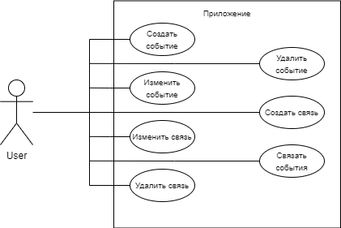
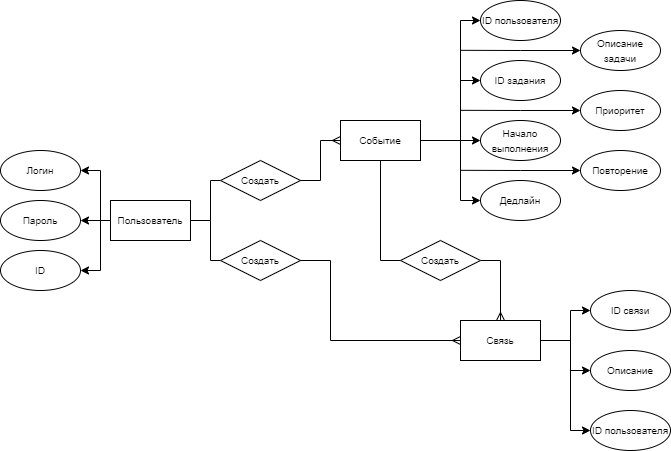

# BMSTU-PPO
 
## Название проекта
DWasteT

## Краткое описание идеи проекта
Создать приложение для организации времени пользователя, в котором можно создавать новые списки дел (To-Dos), вычёркивать сделанные пункты, удалять, либо редактировать их, сохранять состояние списка дел, чтобы вернуться к нему позже, и удалять список дел целиком.

## Краткое описание предметной области
Данное приложение предназначено для людей, желающих удобно организовать свое расписание и контролировать свое время.

Сущности предметной области:
1. Задача - сущность, описывающая определенную задачу. Параметры каждой задачи - начало и время выполнения,период повторения, пользователь, приоритет.
2. Пользователь - сущность, описывающая пользователя приложения. Основные параметры - login/password для входа, id пользователя.
3. Связь - сущность принадлежности, задача может быть связана с несколькими сущностями. Каждая связь обозначает принадлежность задачи к определённой группе сущностей.

## Краткий анализ аналогичных решений по 3 критериям
|Название приложения|Desktop версия|Календарь|Повторящющиеся события|Приоритет задач|Уровни планирования|Списки завершённых событий|
|-|-|-|-|-|-|-|
|Microsoft To Do|x|v|x|v|v|v|
|TickTick|v|v|x|x|v|v|
|Outlook|v|x|x|x|v|x|
|Todoist|x|x|x|v|v|v|
|2Day|v|v|v|x|x|v|

## Краткое описание целесообразности и актуальности проекта
Органайзеры всегда пользовались спросом, не всегда удается держать в голове список всех запланированных дел. На сегоднешний день существует множество готовых решений, но большинство рассчитано на совместное использование списка дел, с большим количеством ненужного функционала и требованием наличия интернет соединения. Целесообразность проекта заключается в создании личного приложения с удобным и понятным функционалом, и уверенностью за сохранность данных.

## Use-Case

## ER-диаграмма

## Архитектурные характеристики, важные для проекта
- Безопасноть
- Расширяемость
- Быстродействие
- Надёжность
- Качество работы
- Отказоустойчивость
- Масштабируемость
